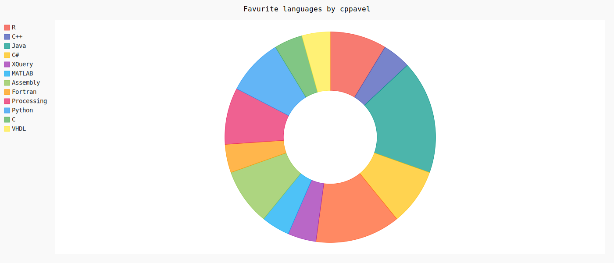

To run the program download the repository

Have python installed

Install pip using : 'get_pip.py'

Install the dependencies using this command : 'py -m pip install -r pippackage.txt'

Here is the command to run the project: 'display.py'

The file display.py fetches info from the Github API about a specified user and visualises this data in the form of a bar chart, pie chart and gauge chart using the pygal library.

### user/Cppavel

